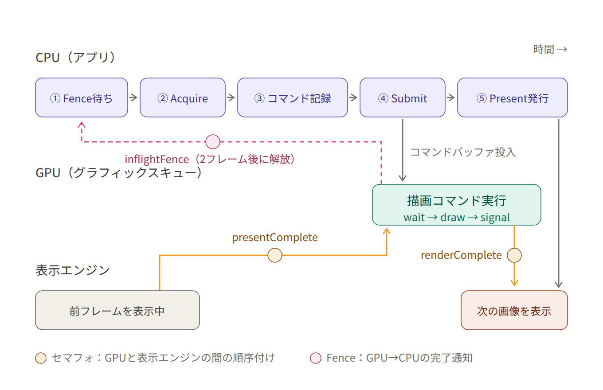
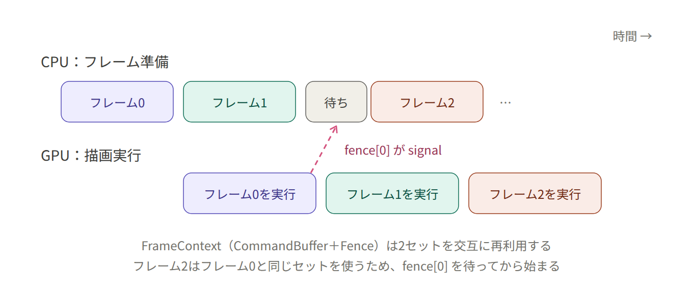

# Vulkan メンタルモデル ノート

> 「Vulkan実践入門」写経プロジェクトの学習ノート。
> 個々の `Vk*` API ではなく、**オブジェクト間の関係**と**時間軸上の順序**を掴むためのメモ。
> 習熟度: 4章完了（Cube/Sphere をディスクリプタ + UBO + 深度バッファ付きで描けた段階）。
> 目的は「何かを作る」より「Vulkanを使いこなして知る」こと。
> 更新履歴: 2026-07-11 三角形完了時点で作成 / 2026-07-20 4章完了時点に更新（§4 を追加）。

---

## 使い方のコツ

- いきなり全部読むより、**各章の図を自分で再現 → このノートで答え合わせ**。
- 写経は2回やる。2回目は教科書を閉じ、**コメントを自分の言葉で先に書いてから**コードを埋める。
  書けない箇所が「今まだ霞んでいる点」。
- 効く絵は3枚: ①依存ツリー（空間） ②CPU/GPU 2本タイムライン（時間） ③1フレームのデータフロー。
  ①②は1章（§2, §3）、③は4章でようやく実体が揃った（§4.5）。

---

## §1. `Vk*` を3種類に仕分ける

`Vk` で始まるものは役割が3つしかない。名前を見たら「モノ? 設計図? 動詞?」と機械的に分類する。

### ① ハンドル（モノ）
`VkInstance`, `VkDevice`, `VkBuffer`, `VkImage`, `VkPipeline`, `VkFence` ...
- GPU側に実体がある「不透明な参照」。中身は見えない（ポインタのような整数）。
- **必ず `vkCreate*`/`vkAllocate*` で生まれ、`vkDestroy*`/`vkFree*` で死ぬ**。生成と破棄が対。

### ② CreateInfo（設計図 = 注文票）
`VkBufferCreateInfo`, `VkSwapchainCreateInfoKHR` ...
- ハンドルを作るときに埋める構造体。全API共通の形:

```
VkXxxCreateInfo（設計図を埋める） → vkCreateXxx（GPUに作らせる） → VkXxx（ハンドルを得る）
```

- **コードの8割はこの「設計図を埋める作業」**。だから冗長に見える。

### ③ コマンド（動詞）
`vkCmdDraw`, `vkCmdBindPipeline`, `vkCmdBeginRendering`, `vkCmdCopyBuffer` ...
- `vkCmd` で始まる = **コマンドバッファに「録画」される命令**。即実行ではない。
- `Begin()`〜`End()` の間に記録され、`vkQueueSubmit` で初めてGPUに送られ実行。
- `vkCmd` が付かない関数（`vkCreate*` 等）はCPU側で即実行。
- **`vkCmd` の有無の区別が決定的に重要。**
- 4章で増えた動詞も同じ規則: `vkCmdBindDescriptorSets`, `vkCmdBindIndexBuffer`,
  `vkCmdDrawIndexed`, `vkCmdPipelineBarrier2`（転送後のバリア）。
- 例外に見えるが実は仕分けできるもの: `vkUpdateDescriptorSets` は `vkCmd` なし = CPU側で即実行
  （ディスクリプタの「配線替え」は録画ではない。§4.2）。

---

## §2. オブジェクトの依存ツリー

Vulkanのオブジェクトは厳密なツリー。`VulkanContext::Initialize`（`lib/stage1/core/vulkan_context.cpp:40`）の
初期化順序と一致する。4章までに触ったものを章マーク付きで書くと:

```
VkInstance                          ← アプリとVulkanの接点
 └ VkPhysicalDevice                 ← 物理GPU（選ぶだけ。作らない）
     └ VkDevice                     ← 論理デバイス。以降ほぼ全APIの第1引数
         ├ VkQueue                  ← コマンドの投入口
         ├ VkCommandPool → VkCommandBuffer
         ├ VkDescriptorPool → VkDescriptorSet         [4章] 実引数の束（§4.2）
         ├ VkDescriptorSetLayout                      [4章] 引数の型宣言（§4.2）
         ├ VkPipelineLayout                           [4章] パイプライン側の引数宣言
         ├ VkSwapchainKHR → VkImage / VkImageView     ← 画像は「借り物」
         ├ VkBuffer + VkDeviceMemory                  [4章] Vertex/Index/Uniform/Staging
         ├ VkImage + VkDeviceMemory + VkImageView     [4章] DepthBuffer = 初の自作イメージ（§4.4）
         ├ VkShaderModule → VkPipeline
         └ VkFence / VkSemaphore    ← 同期プリミティブ
```

含意:
- **破棄は生成の逆順**。`Cleanup()`（`vulkan_context.cpp:50`）は Device → Instance の順。
  子が生きてるのに親を壊すとクラッシュ。アプリ側も同じで、`SimpleCubeApp::OnCleanup` は
  まず `vkDeviceWaitIdle` でGPUを待たせてから、パイプライン → リソース → レイアウトの順に壊す。
- ほぼ全ての `vkCreate*` の第1引数が `VkDevice` = **論理デバイスが全リソースの所有者**。
  `VkDevice` を中心に放射状にぶら下がる絵を描くと繋がる。
- スワップチェーンの `VkImage` はスワップチェーンが作った借り物（自分で `vkDestroyImage` しない）。
  対して `DepthBuffer` の `VkImage` は自作・自壊。**同じハンドル型でも所有者が違う**（§4.4）。

---

## §3. フェンスとセマフォ：「誰が誰を待つか」

違いは1点だけ: **待つ主体がCPUかGPUか**。

|                  | Fence                          | Semaphore                       |
|------------------|--------------------------------|---------------------------------|
| 待つ主体          | **CPU**（ホスト）               | **GPU**（キュー間）              |
| 用途             | GPUの仕事が終わったかCPUが確認    | GPU処理Aの完了を処理Bが待つ       |
| CPUから状態が見える | はい（`vkWaitForFences`）        | いいえ（CPUは触れない）           |
| 典型例           | フレーム完了待ち                 | acquire→描画→present の連結       |

### Fence（CPU↔GPU） — `vulkan_context.cpp:98` AcquireNextImage

```cpp
vkWaitForFences(..., &fence, VK_TRUE, UINT64_MAX);  // CPUがここで止まって待つ
...
vkResetFences(..., &fence);                          // 待ち終えたらリセット
```

投入時にGPUへ「終わったら立てろ」と渡す（`:135`）:

```cpp
vkQueueSubmit(m_graphicsQueue, 1, &submitInfo, frame.inflightFence);
//                                              ↑完了したらGPUがsignalする
```

→ 「2フレーム前のコマンドバッファ、もう再利用していい?」をCPUが確認する仕組み。
   これがないと、まだ描画中のコマンドバッファを上書きしてしまう。
   4章からは UBO とディスクリプタセットも同じ理由で守られている（§4.3）。

### Semaphore（GPU↔GPU） — `vulkan_context.cpp:118` SubmitPresent

```cpp
submitInfo.pWaitSemaphores   = &presentCompleteSem;  // 画像取得が済むまで描画開始するな
submitInfo.pSignalSemaphores = &renderCompliteSem;   // 描画が終わったら立てる
vkQueueSubmit(...);
m_swapchain->QueuePresent(...);  // present側はrenderCompleteを待つ（swapchain.cpp:154）
```

連鎖:

```
[acquire] --presentComplete--> [描画 draw] --renderComplete--> [present 表示]
```

CPUはこの待ち合わせに一切関与しない。GPUが内部で順序を守る。

### 落とし穴2つ
- **初期SIGNALED**（`vulkan_context.cpp:348`）: フェンスは `VK_FENCE_CREATE_SIGNALED_BIT` で
  「最初から立った状態」で作る。1フレーム目の `vkWaitForFences` で永久に止まらないため。
- **2系統が併存する理由**: Fenceは「コマンドバッファ再利用の安全性（リソース寿命）」、
  Semaphoreは「描画パイプライン段階の順序（実行順）」。**守る対象が違う**ので両方要る。

### 描くべき図
CPU軸とGPU軸の2本タイムライン。Fence = CPUが横切る縦線、Semaphore = GPU内の横矢印。
→ `AcquireNextImage` → `SubmitPresent` の実際の関数呼び出しに対応づける。**（宿題・継続中）**

---

## §3.5 答え合わせ用：1フレームの時系列（2026-07-11 AIセッションで整理）

> ⚠️ これは §3 の宿題（手描きタイムライン）の**答え合わせ用リファレンス**。
> 記憶に定着させるのが目的なので、**先に紙に自分で描いてから**ここを読むこと。

### 登場人物は3人

CPU（アプリ）・GPU（グラフィックスキュー）・表示エンジン（モニタに出す機構）。
3人は勝手に並走するので、セマフォとFenceで「追い越し禁止」の約束を結ぶ。

### `OnDrawFrame` の5ステップと呼び出し対応

| # | ステップ | 実際の呼び出し | 場所 |
|---|---------|--------------|------|
| ① | Fence待ち | `vkWaitForFences` | `vulkan_context.cpp` AcquireNextImage 冒頭 |
| ② | Acquire | `vkAcquireNextImageKHR` → 成功時 `vkResetFences` | `swapchain.cpp` AcquireNextImage |
| ③ | コマンド記録 | バリア→クリア→描画→バリア | 各章アプリの OnDrawFrame |
| ④ | Submit | `vkQueueSubmit`（wait/signal/fence を添える） | `vulkan_context.cpp` SubmitPresent |
| ⑤ | Present発行 | `vkQueuePresentKHR` → `AdvanceFrame` | `swapchain.cpp` QueuePresent |

①が**CPUが唯一ブロックする場所**。②は「次に描いていい画像の番号」が即返るが、
画像自体はまだ表示中かもしれない（だからセマフォが要る）。③はCPU側の録画だけで
GPUはまだ何もしていない。④⑤はどちらも投げっぱなしでCPUは待たない。
4章では②と③の間に「UBO更新」というCPUの書き込みが1つ増えた（§4.5）。

### タイムライン（宿題で描くべき絵）



### 3つの同期オブジェクトの向き

| 同期オブジェクト | signalする側 | 待つ側 | 守っているもの |
|---|---|---|---|
| `presentComplete` セマフォ | 表示エンジン | GPU（色書き込み段） | 表示中の画像への上書き |
| `renderComplete` セマフォ | GPU（描画完了時） | 表示エンジン | 描きかけ画像の表示 |
| `inflightFence` | GPU（submit完了時） | CPU（2フレーム後の①） | コマンドバッファ・UBOの再利用 |

セマフォ2つは**向きが逆の関門**。`presentComplete` は「表示エンジン→GPU」（まだ表示中の
画像に描くな）、`renderComplete` は「GPU→表示エンジン」（描き終わってない画像を表示するな）。
どちらもCPUは関与しない。

### なぜFenceは「2フレーム後」か（並走の絵）

`MaxInflightFrames = 2` なので FrameContext（CommandBuffer + Fence）は2セットを交互再利用。
フレーム2はフレーム0と同じセットを使うため、fence[0] のsignalを待ってから始まる。
逆に言えば **GPUが1フレーム遅れていてもCPUは止まらず先の準備を進められる**のが狙い。



### 細部の補足（2周目で効いてくる）

- **`pWaitDstStageMask = COLOR_ATTACHMENT_OUTPUT`**: GPUはセマフォを待つ間も
  頂点シェーダーなど「色を書く前の仕事」は先に始められる。待ちが効くのは色を書く瞬間だけ。
- **`presentComplete` はプール方式**（`swapchain.cpp` CreateFrameContext / AcquireNextImage）:
  acquire は「どの画像が返るか分からない状態でセマフォを先に渡す」必要があるため、
  画像数+1個をローテーションし、acquire 成功後にその画像へ紐付け直す。
- 初期SIGNALEDの理由は §3「落とし穴2つ」参照。

---

## §4. 4章で増えた絵：リソースの引っ越しとディスクリプタの配線（2026-07-20 追加）

1章の三角形は「頂点を流し込んで描くだけ」だった。4章の Cube/Sphere で増えたのは、
**データをGPUの速い場所に引っ越す仕組み**（§4.1）と、**毎フレーム変わるデータをシェーダーに
届ける配線**（§4.2〜4.3）、そして**自作のイメージ**（§4.4）。どれも `02_simplecube` に実物がある。

### §4.1 メモリには2つの置き場がある：ステージング転送

CPUから見えるかどうかで、GPUメモリは2種類に分かれる。

| | `HOST_VISIBLE`（+COHERENT） | `DEVICE_LOCAL` |
|---|---|---|
| CPUから `Map`/`memcpy` | できる | **できない** |
| GPUからの読み速度 | 遅め | 速い |
| 1章の使用例 | 三角形の頂点バッファ | （未使用） |
| 4章の使用例 | UniformBuffer / StagingBuffer | Cubeの Vertex/IndexBuffer, DepthBuffer |

`DEVICE_LOCAL` にはCPUが直接書けないので、**引っ越し便**が要る。それがステージング転送
（`ResourceUploader`, `lib/stage1/core/resource_uploader.cpp`）:

```
CPUのvector<Vertex>
  --Map/memcpy--> StagingBuffer (HOST_VISIBLE)          ← CPUが書ける仮置き場
  --vkCmdCopyBuffer--> VertexBuffer (DEVICE_LOCAL)      ← GPU内のコピー（録画される動詞）
  --vkCmdPipelineBarrier2--> 頂点読み取り可能            ← 「コピー完了後に読め」の順序約束
```

押さえどころ:
- `UploadBuffer` は転送を**予約するだけ**（staging に書いて登録）。実行は `SubmitAndWait` に
  まとめられる。①記録 ②submit ③フェンス待ち、という**フレームループのミニチュア**になっている。
  セマフォが出てこないのは表示エンジンが絡まないから（待つのはCPUだけ = Fenceで足りる。§3の表と整合）。
- 置き場の選び方は「**CPUが何回書くか**」で決まる: 起動時に1回きり（頂点・インデックス）は
  `DEVICE_LOCAL` + ステージング転送、毎フレーム書く（UBO）は `HOST_VISIBLE` のまま直接 `memcpy`。
- ちなみに転送先が `HOST_VISIBLE` なら `UploadBuffer` はその場で `memcpy` して終わる。
  三角形の頂点バッファがステージング無しで済んでいたのはこの形。

### §4.2 ディスクリプタ：シェーダーへの「配線」は関数呼び出しの絵で掴む

ディスクリプタ周りは登場人物が多いが、**関数呼び出しのアナロジー**で1対1に対応づく。

| Vulkanオブジェクト | 関数呼び出しで言うと | `02_simplecube` での実物 |
|---|---|---|
| `VkDescriptorSetLayout` | 引数の**型宣言**（シグネチャ） | binding 0 に UBO、VS+FS から可視 |
| `VkPipelineLayout` | パイプライン側の「この型の引数を受け取る」宣言 | setLayout 1個だけ |
| `VkDescriptorSet` | **実引数の束**（実体への参照） | UBO[i] を指す。プールから確保 |
| `vkUpdateDescriptorSets` | 実引数に実体を代入する（CPU側・即実行） | set[i] ← UBO[i] の配線 |
| `vkCmdBindDescriptorSets` | 呼び出し時に引数を渡す（録画される動詞） | 描画直前に set[frameIndex] |

配線の全体図（データが流れる向きで）:

```
C++: SceneConstants 構造体
  --毎フレーム Map/memcpy--> UniformBuffer[frameIndex] (VkBuffer)
                                  ↑ vkUpdateDescriptorSets（初期化時に1回配線）
        DescriptorSet[frameIndex] ┘
  --vkCmdBindDescriptorSets--> パイプライン
  --> GLSL: layout(set=0, binding=0) uniform SceneConstants { ... }
```

落とし穴（写経ミスから学んだこと、learning-log 2026-07-04）:
- **CPU構造体とGLSL側のレイアウト一致は Vulkan が検証しない**。CPUとGPUは「同じ構造体」を
  共有しているのではなく「同じバイト列を別々に解釈」しているだけ。`mat4` と `vec4` を
  取り違えてもビルドは通り、絵が壊れて初めて気づく。
- 頂点属性も同じ構図: C++の `offsetof(Vertex, normal)` と GLSL の `layout(location=1)` を
  自分の手で対応づけている。**「CPU側メモリレイアウト ↔ シェーダー側宣言」の突き合わせは
  全て人間の責任**、がVulkan流。

### §4.3 「×2」が増殖する理由：Fenceが守るものリスト

1章の時点で「×2」（インフライトフレーム数）だったのは CommandBuffer と Fence。
4章で **UBO×2 と DescriptorSet×2 が仲間入り**した。理由は全部同じで、
フレームNとN+1が並走する（§3.5）ため、GPUがまだ読んでいるフレームNのデータを
CPUがフレームN+1の値で上書きしてはいけないから。

判定基準はこう言い切れる:
**「CPUが毎フレーム書き、GPUが後から読むもの」はインフライト数だけ複製し、Fenceで再利用を守る。**

一方、個数が「×2」でないものもある。1フレームに登場する主なリソースの個数表:

| 個数 | もの | 周期の正体 |
|---|---|---|
| ×2（インフライト数） | CommandBuffer, inflightFence, UniformBuffer, DescriptorSet | CPUとGPUの並走 |
| ×画像数（3枚前後） | スワップチェーンの VkImage/VkImageView, renderComplete セマフォ | 表示のローテーション |
| ×(画像数+1) | presentComplete セマフォ（プール方式, §3.5） | acquire の先渡し |
| ×1 | Pipeline, PipelineLayout, DescriptorSetLayout, VertexBuffer/IndexBuffer, DepthBuffer | フレームをまたいで不変 |

**「インフライト数（2）」と「スワップチェーン画像数（3前後）」は別の周期**で、
`frameIndex`（`GetCurrentFrameIndex`）と `imageIndex`（`GetCurrentIndex`）として
コードにも別変数で現れる。ここを混同すると同期の絵が描けなくなるので注意。

### §4.4 深度バッファ：初めて自分で作る VkImage

スワップチェーンの画像は借り物だったので、`DepthBuffer`
（`lib/stage1/core/image_resource.cpp`）が**イメージを自作する初めての例**になる。
手順はバッファと同型で、イメージ特有の「ビュー」が最後に付く:

```
CreateInfo → vkCreateImage → メモリ要件取得 → vkAllocateMemory → vkBindImageMemory → vkCreateImageView
```

- `VkBuffer` も `VkImage` も「ハンドルとメモリが別オブジェクトで、Bindで結婚する」構図は共通。
- 深度テストは2箇所の設定で1セット: パイプライン側（`depthTestEnable` + `COMPARE_OP_LESS`）と
  描画時のアタッチメント側（`loadOp = CLEAR`, クリア値 1.0 = 一番遠い）。
  立体の前後関係はGPUがピクセル単位で解決してくれるので、描画順を気にしなくてよくなる。

### §4.5 1フレームのデータフロー（③の絵、4章版）

三角形の5ステップ（§3.5）に、**CPUの書き込みが1つ、バインドが2つ**増えただけ。差分を太字で:

```
① Fence待ち（vkWaitForFences）
② Acquire（画像番号をもらう）
③ **UBO更新**: SceneConstants を組んで UniformBuffer[frameIndex] へ memcpy   ← CPUの仕事
④ 記録:
    バリア（UNDEFINED → COLOR_ATTACHMENT）
    BeginRendering（color + **depth** の2アタッチメント）
    パイプライン / 頂点バッファ / **インデックスバッファ** / **DescriptorSet[frameIndex]** をバインド
    **vkCmdDrawIndexed(36, ...)**
    EndRendering
    バリア（COLOR_ATTACHMENT → PRESENT_SRC）
⑤ Submit（wait/signal/fence を添えて投函）
⑥ Present発行 → AdvanceFrame
```

- ③で書く先を `frameIndex` で選ぶのが §4.3 の「×2」の実践。
- 行列（World/View/Proj）は③でCPUが計算し、GPUは頂点シェーダーで掛けるだけ。
  「何を描くか（ジオメトリ、起動時に転送済み）」と「どう見るか（行列、毎フレーム更新）」が
  別経路でGPUに届く、という絵で覚える。
- 頂点フォーマットが同じなら、ジオメトリ（Cube/Sphere）を差し替えてもシェーダーも
  パイプラインも無改造で動く。描画の配線とデータの中身が疎結合になっている証拠。

---

## §5. これらを支えるC++の考え方

要は「`Vk*` ハンドルという生資源を、C++のRAIIでどう飼い慣らすか」。

### (a) ハンドルは生ポインタと同じ＝危険物
中身が見えない整数で、デストラクタも参照カウントもない。作ったら手で壊す必要 = 生 `new`/`delete` と同じ危うさ。

### (b) ライブラリの答え: RAIIで包む
`CommandBuffer`（`lib/stage1/core/command_buffer.h:5`）が例。生 `VkCommandBuffer` をメンバに持ち、
`operator VkCommandBuffer()`（`:16`）で必要時は生ハンドルとして振る舞う。
API に渡すときは暗黙変換、管理はC++オブジェクトに任せる。

### (c) shared_ptr + コピー禁止 = GPU資源の所有権モデル
`gpu_resource_base.h`:

```cpp
GpuResourceBase(const GpuResourceBase&) = delete;   // コピーすると二重破棄 → 禁止
static std::shared_ptr<T> Create() { ... }          // 必ず参照カウント管理
```

GPU資源は「一つの実体を複数で参照、最後の1人が消えたら破棄」が自然 = `shared_ptr` + コピー禁止。
**C++のRAII/所有権の道具を、寿命を持つGPUハンドルに当てはめている** ——ここが核。

### (d) 4章で見えた設計の骨格（2026-07-20 追記）
- **CRTP + 2段構え**: `BufferResource<VertexBuffer>` のように「自分の型」を親に渡し、
  `Create()`（shared_ptr確保）と `Initialize()`（Vulkanオブジェクト生成、失敗はboolで返す）を
  各派生の `static Create(引数...)` が一発で包む。コンストラクタで失敗を扱えない問題の回避策。
- **インターフェース分離**: `IBufferResource` / `IImageResource` は「バッファ4兄弟
  （Vertex/Index/Uniform/Staging）を同じ土俵で扱う」ための抽象。`ResourceUploader` が
  転送先を `IBufferResource*` で受けられるのはこのおかげ。
- **テンプレートの実体は .cpp にある**という罠: メンバ関数の定義を書き忘れる/明示的
  インスタンス化が無いと、コンパイルは通って**リンクで死ぬ**（`undefined reference` /
  `vtable for X`）。切り分け方は learning-log 2026-07-17 の「ビルド失敗3層」参照。
- `ResourceUploader` はGPU資源そのものではなく**手続きのまとめ役**なので、shared_ptr階層に
  入れず普通のメンバとして持つ。リソース（寿命管理が要る）とヘルパー（要らない）の使い分け。

> 注: Fence/Semaphore 自体はこのライブラリではまだ生ハンドル（`VkFence inflightFence`,
> `vulkan_context.h:52`）で手動管理。`CommandBuffer` のようなRAIIラッパーにはしていない。
> 「もし自分でRAIIラッパーを書くなら?」と考えるのが (b)(c) の理解確認の良い練習。

---

## §6. 学習法（メタ）

Vulkanの難しさは個々のAPIでなく**オブジェクト間の関係と時間軸上の順序**にある。
コードは関係を平たくしか表現できない。だから:

- **読む** = 個々のAPIの意味を知る（点を作る）
- **書く（写経）** = 手が順序を覚える（点を強くする）
- **描く** = 関係と時間軸を可視化する（**点を線にする = シナプス**）← ここの比重を上げると効率が跳ねる

三角形の時点で同期・リソース・パイプラインの3大概念に触れ、4章でそれぞれが1段深くなった:
同期は「Fenceが守るものが増える」（§4.3）、リソースは「置き場と引っ越し」（§4.1）、
パイプラインは「ディスクリプタという引数機構」（§4.2）。**新概念が増えたのではなく、
既にある3本の柱が太くなった**と捉えると、5章以降も同じ柱に積んでいける。

---

## 読書順 / 次にやること

1. `01_triangle/main.cpp` — 骨組みと初期化順序（§2）
2. `vulkan_context.cpp` Initialize / AcquireNextImage / SubmitPresent — **同期とフレーム（最重要・最難関）**（§3, §3.5）
3. `02_simplecube/simplecube_app.cpp` OnInitialize → CreateCubeGeometry + `resource_uploader.cpp` — ステージング転送（§4.1）
4. 同 CreateDescriptorSetLayout → CreateUniformBuffers → CreateDescriptorSets → OnDrawFrame — 配線と×2（§4.2, §4.3, §4.5）
5. `gpu_resource_base.h` → `buffer_resource.h` / `image_resource.h` — リソース設計のイディオム（§5）

### 宿題（未完）
- [ ] §3 の CPU/GPU 2本タイムライン図を、`AcquireNextImage`→`SubmitPresent` の実際の呼び出しに対応づけて紙に描く（答え合わせ → §3.5）
- [ ] §4.2 の配線図と §4.3 の個数表を、教科書とこのノートを閉じて白紙から再現する
- [ ] §5 の「Fence/Semaphore を自分でRAIIラッパー化するなら?」を考える
